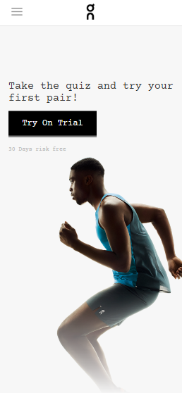
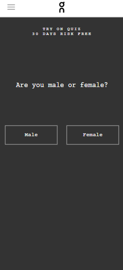
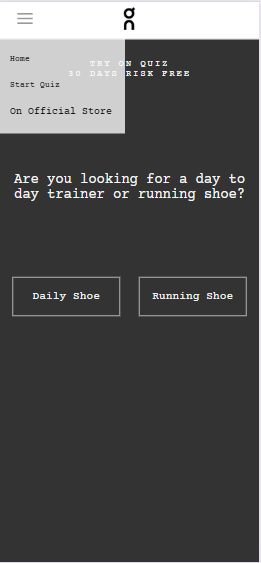
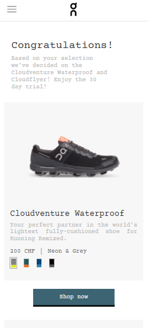
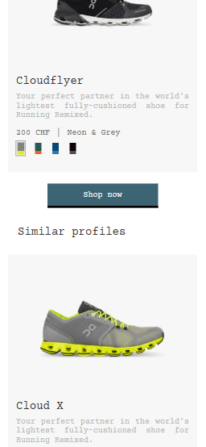
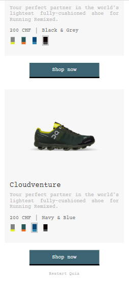
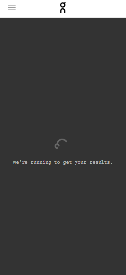

# PROJECT DESCRIPTION

This application allows users to complete a short quiz to determine their ideal On running shoe.

Each answer contributes points to one or more shoes and determines the following question.

At the end of the quiz, the highest-scoring shoe (or two shoes in the case of a tie) is presented as the recommended match. The remaining shoes are then displayed in descending order based on their compatibility score.

# LIVE DEMO

Project Deployed using Vercel:

https://on-frontend-challenge-luniballony.vercel.app/

# Features

- Responsive design
- Interactive quiz flow
- Shoe recommendation based on user answers
- Animated loading screen

# AUTHOR:

- Matilde Carmo (GitHub: Luniballony)

# BUILT WITH:

- JavaScript
- React
- SCSS
- Vite

# DEPENDENCIES:

- sass

# REQUIREMENTS:

- Node.js (18+ recommended)
- npm

# TO INSTALL & RUN: 
1. Navigate to `/frontend`
2. Run `npm install`
3. Run `npm run dev`


# Design Decisions

- React components were kept small and reusable
- SCSS was used to separate styling concerns
- Shades dataset and dynamic rendering was created to simplify future expansion of the product database
- Given the relatively small dataset, recommendations are limited to a maximum of two featured shoes. Remaining shoes are displayed under "Similar Profiles" and sorted by compatibility score. With a larger dataset, this list would likely be limited to only the closest matches

# TRADEOFFS:

- Shoe shades were simplified because the provided dataset did not include shade-specific information
- The **Shop Now** button redirects to the official On Switzerland website, as the provided dataset does not include direct links to individual product variants
- A short artificial delay is used before displaying the results so the required loading screen can be shown. In a production environment, this would typically be replaced by an asynchronous API request

# FUTURE IMPROVEMENTS:

- Expand the product database
- Introduce a backend for managing quiz questions and product data
- Add an About page
- Improve animations and page transitions
- Perform cross-browser testing and compatibility improvements
- Add automated unit and integration tests

# POST-SUBMISSION IMPROVEMENTS:

Branch contains improvements made after the original submission.
It will remain separate from the submitted version to preserve a clear distinction between the two.
 
 - Created new branch with React Router navigation 
 - Improved navigation flow between quiz states
 - Add Not Found Page for invalid urls

# TESTING:

Project was tested on:

- Windows 
- Chrome
  
Responsive layouts were verified using:

- Pixel 7
- iPhone 12 Pro
- Samsung Galaxy S20 Ultra
- iPad Air
- iPad Pro
- 

# FOLDER STRUCTURE:
```
frontend/
├── public/
│   ├── assets/
│   └── shoes/
└── src/
    ├── components/
    ├── data/
    ├── hooks/
    └── screens/
```

    
# ASSETS SCOURCES:

- On Assets (images and dataset): https://github.com/onrunning/frontend-eng-challenge 
- Font: https://fonts.google.com/specimen/Courier+Prime?categoryFilters=Appearance:%2FMonospace%2FMonospace&preview.script=Latn
- Tab Icon: https://www.facebook.com/On/
- On Logo: https://seeklogo.com/vector-logo/439325/on 

# LAYOUTS (taken from Pixel 7 model):








